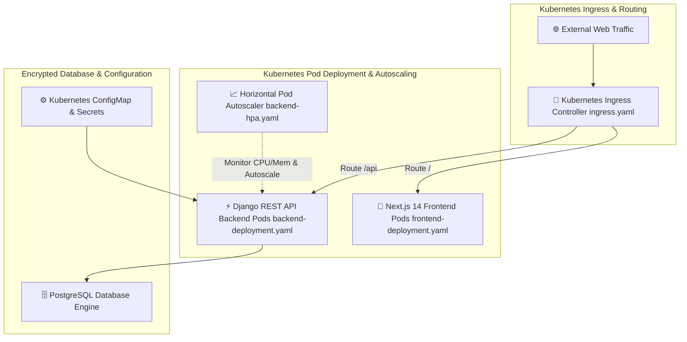

# 🛡️ Complaint Platform — Cloud-Native Kubernetes Microservices Platform

[](https://kubernetes.io/)
[](https://www.docker.com/)
[](https://www.terraform.io/)
[](https://www.djangoproject.com/)
[](https://nextjs.org/)

---

## 📌 Executive Summary & Problem Statement

### The Problem
Deploying traditional web applications on unmanaged virtual servers creates critical scaling and operational bottlenecks:
1. **Monolithic Vulnerability to Traffic Spikes:** During high-volume reporting periods, a sudden surge in traffic can overload monolithic backend servers, leading to system outages.
2. **Lack of Automated Self-Healing:** Manual container monitoring requires human intervention when application instances crash or run out of memory.
3. **Data Security & Spam Risk:** Anonymous reporting systems are vulnerable to duplicate submission spam and unencrypted data exposure in central databases.

### The Complaint Platform Solution
The Complaint Platform is a **cloud-native, containerized microservices platform** engineered to deliver high-availability, automatic scaling, and secure data handling:
- **Kubernetes Orchestration:** Manages backend API services and frontend web applications into isolated pod replicas controlled by **Kubernetes Ingress** resources.
- **Horizontal Pod Autoscaling (HPA):** Monitors CPU and memory consumption dynamically, automatically scaling pod instances up or down based on load.
- **Data Security & Spam Safeguards:** Encrypts report contents at rest in **PostgreSQL** using AES encryption, enforces submission cooldown limits, and detects duplicate spam via Jaccard similarity algorithms.
- **Terraform Infrastructure Automation:** Provisions cloud cluster nodes, networking security groups, and database instances using modular HCL code.

---

## 📐 System Architecture



---

## 🔍 Step-by-Step Technical Workflow

1. **Traffic Routing:** Incoming web traffic enters the cluster via the **Kubernetes Ingress Controller** (`ingress.yaml`). Ingress rules route root requests (`/`) to Next.js frontend pods and API requests (`/api/`) to Django REST Framework backend pods.
2. **Anonymous Session & Anti-Spam Check:** When a user submits a report, the backend middleware validates submission quotas (daily/weekly limits) and evaluates text content against existing entries using **Jaccard similarity algorithms** to block redundant spam.
3. **AES Data Encryption:** Sensitive report payloads are encrypted using AES encryption before committing to the **PostgreSQL** database.
4. **Dynamic Pod Scaling (HPA):** The **Horizontal Pod Autoscaler** (`backend-hpa.yaml`) queries metrics server data. If CPU utilization exceeds target thresholds (e.g., 70%), HPA automatically provisions additional API pod replicas.
5. **Configuration Injection:** Database connection strings, encryption keys, and environment variables are injected into running containers at runtime using **Kubernetes ConfigMaps** and **Secrets**.

---

## 📂 Repository Directory Structure

```text
complaint/
├── backend/
│   ├── complaints/                 # Django Application Module
│   │   ├── models.py               # Database Models (Complaint, Category, Action)
│   │   ├── views.py                # API Endpoint Views & Quota Rules
│   │   ├── encryption.py           # AES Content Encryption Utilities
│   │   └── throttling.py           # Rate Limiting & Cooldown Throttling
│   ├── core/                       # User Auth, Permissions & Middleware
│   ├── Dockerfile                  # Multi-Stage Backend Dockerfile
│   ├── requirements.txt            # Python Dependencies
│   └── manage.py                   # Django Management Script
├── frontend/
│   ├── app/                        # Next.js 14 App Router Pages
│   ├── components/                 # Reusable UI Components
│   ├── Dockerfile                  # Multi-Stage Frontend Dockerfile
│   └── package.json                # Frontend Dependencies
├── k8s/
│   ├── namespace.yaml              # Kubernetes Dedicated Namespace Definition
│   ├── configmap.yaml              # Environment Variable ConfigMap
│   ├── backend-deployment.yaml     # Django API Deployment Specification
│   ├── backend-service.yaml        # Internal ClusterIP Service for Backend
│   ├── backend-hpa.yaml            # Horizontal Pod Autoscaler for Backend
│   ├── frontend-deployment.yaml    # Next.js App Deployment Specification
│   ├── frontend-service.yaml       # Internal ClusterIP Service for Frontend
│   ├── frontend-hpa.yaml           # Horizontal Pod Autoscaler for Frontend
│   └── ingress.yaml                # NGINX Ingress Routing Rules
├── terraform/
│   ├── main.tf                     # EKS Cluster & Networking Infrastructure
│   ├── variables.tf                # Cluster Variables
│   └── outputs.tf                  # Infrastructure Endpoints
├── docker-compose.yml              # Local Development Multi-Container Setup
└── README.md                       # Comprehensive Project Documentation
```

---

## 🛠️ Technology Stack Breakdown

- **Container Orchestration:** Kubernetes (k8s Deployments, Services, HPA, Ingress, ConfigMaps)
- **Backend Framework:** Python, Django REST Framework (DRF), Gunicorn
- **Frontend Framework:** Next.js 14 (App Router), TypeScript, Tailwind CSS
- **Database:** PostgreSQL
- **DevOps & IaC:** Docker, Docker Compose, Terraform 1.14+

---

## 🚀 How to Run & Deploy Locally

### Prerequisites
- Docker & Docker Compose installed
- `kubectl` installed (for Kubernetes deployment)

### 1. Launch Multi-Container Setup via Docker Compose
```bash
docker-compose up --build
```

### 2. Deploy to Kubernetes Cluster
```bash
kubectl apply -f k8s/namespace.yaml
kubectl apply -f k8s/configmap.yaml
kubectl apply -f k8s/
```

---

## 📄 License
Distributed under the MIT License. See `LICENSE` for details.
