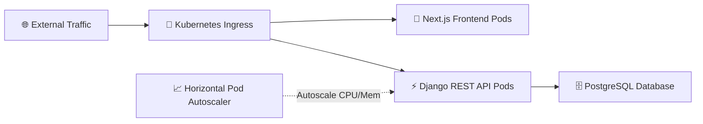

# 🛡️ Complaint Platform — Cloud-Native Kubernetes Infrastructure

[](https://kubernetes.io/)
[](https://www.docker.com/)
[](https://www.terraform.io/)
[](https://www.djangoproject.com/)
[](https://nextjs.org/)

A containerized, multi-tier anonymous complaint management microservice platform orchestrated with **Kubernetes Deployments**, **Horizontal Pod Autoscalers (HPA)**, and **Terraform** on AWS.

---

## 🎯 Architectural Overview

The platform isolates backend API services and frontend web applications into scalable Kubernetes pods. It routes incoming HTTP traffic through a Kubernetes **Ingress controller**, scales pod replicas dynamically using **Horizontal Pod Autoscaling (HPA)** based on CPU/memory usage metrics, and persists encrypted report data to a **PostgreSQL** database.



---

## ⚡ Key Engineering Features

- **☸️ Declarative Kubernetes Manifests:** Authored production specifications (`backend-deployment.yaml`, `backend-hpa.yaml`, `backend-service.yaml`, `ingress.yaml`, `configmap.yaml`).
- **📈 Horizontal Pod Autoscaling (HPA):** Dynamically scales API pod replicas to maintain system performance during volume spikes.
- **🛡️ Data Encryption & Duplicate Detection:** Implements AES content encryption at rest and Jaccard similarity word-overlap algorithms to flag duplicate reporting.
- **📦 Multi-Stage Docker Builds:** Optimizes container image sizes for backend API services and Next.js applications.
- **🏗️ Terraform IaC:** Provisioned underlying cloud infrastructure and PostgreSQL database tiers via HCL scripts.

---

## 🛠️ Technology Stack

- **Container Orchestration:** Kubernetes (k8s Deployments, HPA, Ingress, Services, ConfigMaps)
- **Languages & Frameworks:** Python, Django REST Framework, TypeScript, Next.js 14, Tailwind CSS
- **Databases & Storage:** PostgreSQL
- **Infrastructure & DevOps:** Docker, Docker Compose, Terraform

---

## 🚀 Quickstart & Usage

### 1. Deploy Local Containers with Docker Compose
```bash
docker-compose up --build
```

### 2. Deploy to Kubernetes Cluster
```bash
kubectl apply -f k8s/namespace.yaml
kubectl apply -f k8s/configmap.yaml
kubectl apply -f k8s/
```

---

## 📄 License
Distributed under the MIT License.
